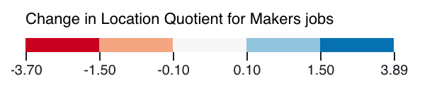
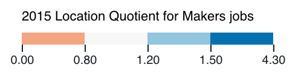

# SF Bay Area Jobs Viz
Visualizing the change in job types of the SF Bay Area from 2002 – 2015 through a *Location Quotient* analysis of U.S. Census' [Longitudinal Employer-Household Dynamics Workplace Area Characteristics data](https://lehd.ces.census.gov/data/).

## Analysis
The U.S. Census LEHD classifies job types using 2-digit NAICS codes to represent the primary industry of the employing company. Rather then analyze each category individually I aggregated them into four "super categories" listed below, following Robert Manduca's analysis for his [Job Dot Map](http://www.robertmanduca.com/projects/jobs.html).

- **Manufacturing and Logistics**: 11 (Agriculture and Forestry), 21 (Mining), 22 (Utilities), 23 (Construction), 31-33 (Manufacturing), 42 (Wholesale Trade), 48-49 (Transportation and Warehousing)

- **Professional Services**: 51 (Information), 52 (Finance and Insurance), 53 (Real Estate), 54 (Professional, Scientific, and Technical Services), 55 (Management of Companies and Enterprises)

- **Healthcare, Education, and Government**: 61 (Educational Services), 62 (Health Care), 81 (Other Services - largely Religious, Grantmaking, Civic, Professional, and Similar Organizations)

- **Retail, Hospitality, and Other Services**: 44-45 (Retail Trade), 56 (Administrative and Support Services), 71 (Arts, Entertainment, and Recreation - largely Amusement, Gambling, and Recreation), 72 (Accomodation and Food Services)

For each of the above super categories, I calculated the location quotient for the years 2002 and 2015 (the extent of the LEHD WAC data available at the time of performing this analysis) at the census tract level. The difference between the 2015 and 2002 location quotients provides an indicator for how much a job sector grew or declined for a given geographic area.

A _Location Quotient_ is a type of economic geography analysis that measures the relative concentration of a given industry in a given place. For this jobs analysis it means comparing the percentage of each super category at the census tract to the percentage of that same category at the nine county SF Bay Area regional level. For example, if a census tract contains 30% Manufacturing and Logistics jobs out of all job types, and the entire SF Bay Area contains 15%, then the location quotient would be determined by dividing the census tract percentage by the regional percentage. In this case the location quotient value would be 2, indicating a higher concentration of jobs in the Manufacturing and Logistics category then the SF Bay Area region as a whole. If that value were closer to 1, it would mean the census tract had about the same percentage of jobs as the region, if it were less then 1 then it would mean the census tract has fewer jobs then the region.

One problem with a location quotient analysis is that it does not take into account the density of the variable being analyzed. When visualizing census tract location quotient, one would not be able to distinguish tracts with relatively few jobs in them from tracts with a high concentration of jobs. To correct for this problem, I calculated the job density for each census tract (number of total jobs divided by number of square miles) and then binned tracts into quintiles based on the density values. In the output maps, the tracts in the lowest quintile have their opacity reduced to 20% so that they are de-emphasized.

Following the analysis I used [Observable](https://beta.observablehq.com/) notebooks and [D3JS](https://d3js.org/) to create choropleth maps for each category and separately for job density at the census tract level. Each map was exported as an SVG file from the browser and touched up using the vector editing software Adobe Illustrator in order to prepare them for print. This primarily meant resizing / cropping the map area, repositioning of labels, and conversion of the maps from SVG to PDF. Nine maps in total were created; one map showing job density of all jobs, and two maps for each super category; one showing the difference in location quotient from 2015 – 2002, and one showing the 2015 location quotient.

Maps showing the change in location quotient were arbitrarily classified using a diverging classification scheme. The breaks are as follows: the first value is the minimum of the location quotient difference, followed by `-1.5`, `-0.1`, `0.1`, `1.5`, and the maximum value of the location quotient difference.

For example, in the "Manufacturing and Logistics" category, the breaks are:

```
-3.70, -1.50, -0.10, 0.10, 1.50, 3.89
```

and the corresponding legend is rendered as follows:



Maps showing the 2015 location quotient used the breaks of `0.8`, `1.2`, and `1.5`. The 2015 location quotient for the "Manufacturing and Logistics" category produces the following breaks where `0` is the min and `4.3` is the max:

```
0, 0.8, 1.2, 1.5, 4.3
```

and legend:



[Color Brewer](http://colorbrewer2.org/) and [d3-scale-chromatic](https://github.com/d3/d3-scale-chromatic) were used for determining the color values for each map's color ramp. I took Color Brewer's advice to limit each classification scheme to five classes so that they would be optimized for print. In the case of the 2015 LQ, there are only 4 classes as I dropped the bottom most / darkest color.

In addition to the nine choropleth maps, I created a stacked bar chart showing the overall trend in the four super categories for each year from 2002 to 2015. This chart is intended to provide context into how these categories have changed in the Bay Area over time. The notable changes are that jobs in the "Manufacturing and Logistics" category dropped by 5%, "Retail, Hospitality, and Other Services" remained constant, "Professional Services" grew by 2%, and "Healthcare, Education, and Government" grew by 3%.

## Data Processing
Running `make` will download data from the U.S. Census and other sources for basemap data processing, then perform the location quotient analysis and basemap data processing. Prior to running `make` you will need to have `miniconda3` installed and a virtual environment created as outlined below in Environment Setup.

You will also need to have the `mapshaper` CLI tool installed and available globally (this also requires NodeJS). The easiest way to do this is: `npm install -g mapshaper`

### Basemap Clipping Polygon
To create a geometry suitable for cropping (in GIS this is known as "clipping") basemap data for the nine county SF Bay Area I did the following.

Using `mapshaper`, dissolve county polygons, convert from multi-polygons to multi-linestrings, and convert from multi-linestring to plain old linestring geometries:

```bash
mapshaper county_boundaries.shp -dissolve -lines -explode -o bay_area_clip.shp
```

Then hand edit the `bay_area_clip.shp` file in QGIS using the "Node Tool", "Split Features", and the "Join Multiple Lines" plugin. This hand editing was necessary to keep bridges and the Transbay Tube intact when clipping osm roads and railways to the 9 county bay area. Essentially the San Francisco Bay is removed and the Golden Gate is closed off to create a single geometry linestring that encompasses the SF Bay Area.

Finally, convert the linestring geometry back into a polygon for use with clipping osm roads and railways using QGIS (Vector > Geometry Tools > Lines to Polygons).

## Environment Setup
For using Python Pandas and GeoPandas for data processing.

First, install [Miniconda3](https://conda.io/miniconda.html) and set up a Python virtual environment with dependencies.

```bash
# install miniconda, for more see: https://pandas.pydata.org/pandas-docs/stable/install.html
bash Miniconda3-latest-MacOSX-x86_64.sh

# make sure to add conda to your PATH
export PATH="/Users/chrishenrick/miniconda3/bin":$PATH

# create virtual env
conda create -n jobs_map_env python

# activate env
source activate jobs_map_env

# install pandas
conda install pandas

# install pip
conda install pip

# install shapely, geos, gdal
conda install shapely
conda install gdal

# install geopandas
conda install -c conda-forge geopandas

# to deactivate the virtual env
source deactivate
```

## Data Sources

- Census Tract 2010 polygons, IPUMS NHGIS, University of Minnesota, https://data2.nhgis.org/

- Census Longitudinal Employer-Household Dynamics Workplace Area Characteristics https://lehd.ces.census.gov/data/

- UC Berkeley Library geodata: https://geodata.lib.berkeley.edu/catalog/ark28722-s7hs4j

- NextZen OSM Metro Extracts: https://www.nextzen.org/metro-extracts/index.html#san-francisco-bay_california

## Credits

- [John Stehlin](https://geography.berkeley.edu/john-stehlin) provided support and direction for the location quotient and job density analysis. Thank you John!

- Another extremely huge thank you to [Robert Manduca](http://www.robertmanduca.com/) for sharing the analysis used in his [Job Dot Map](http://www.robertmanduca.com/projects/jobs.html).

- This work was performed pro bono for the [Anti Eviction Mapping Project](https://www.antievictionmap.com/)'s forthcoming print Atlas. Their work has inspired me to use geographic mapping and data visualization for social justice.

- NHGIS, for providing census tract geometry data: Steven Manson, Jonathan Schroeder, David Van Riper, and Steven Ruggles. IPUMS National Historical Geographic Information System: Version 12.0 [Database]. Minneapolis: University of Minnesota. 2017. http://doi.org/10.18128/D050.V12.0

- [OpenStreetMap](https://www.openstreetmap.org/) Contributors for basemap data used in the printed maps.
